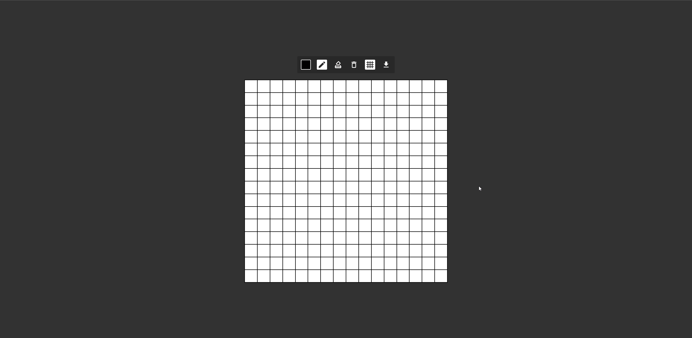

## { App: 'Pixel Art Editor' }

This is a personal project I've decided to create using React to test my knowledge. It is a simple pixel art editor. This editor includes the functionality to select the color you want to use, draw the pixels, erase, delete, toggle the grid and download the image in .png if desired. There is a website to test the project below, I hope you've appreciated it.

[Demo Here](https://feliperdamaceno.github.io/pixel-art-editor)

## Licence

This repository is released under the [**MIT License**](LICENSE).

## From me to you

Hi, my name is **Felipe!**

I'm a Front-End student who wants to share my learning with the community, helping other devs in the same situation.

At the moment I'm studying by myself in 💻 online courses, 📄 reading the documentation, and 💪 hard practicing every day. So if I can, **you could too!**

I hope you've enjoyed this repository and have helped you in some way.

Thanks for checking out and have good learning 😉"

## Contributors

[feliperdamaceno](https://github.com/feliperdamaceno/)

## Contact me

Linkedin: [feliperdamaceno](https://www.linkedin.com/in/feliperdamaceno/)
